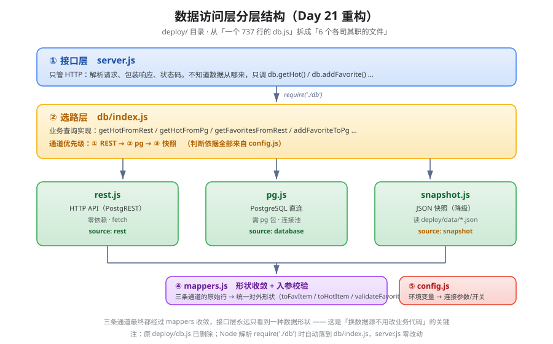

# 数据访问层分层说明（Day 21 重构）

> 本文对应 **Day 19 顺延的重构任务**：把原本 737 行的 `deploy/db.js` 按职责拆成独立文件。
> 核心问题就一句：**拆完之后，「查数据库」这段代码从哪移到了哪？**

---

## 一、为什么要拆

重构前的 `deploy/db.js` 是**一个 737 行的文件**，混了四类职责：

| 职责 | 位置（行号） | 问题 |
|---|---|---|
| 配置与连接（连接串/连接池/SQL 执行） | 21–79 | 与业务查询混在一起 |
| HTTP API（PostgREST）通道 | 81–174 | 通道实现和业务逻辑交织 |
| JSON 快照通道 | 176–185 | 同上 |
| 业务查询（4 个接口）+ 形状转换 + 校验 | 188–737 | 一个函数里塞三个数据源分支 |

**最要命的是第 4 条**：`getHot()` 一个函数里，`hasRestApi()` / `hasDatabase()` / 快照
三个分支全部平铺在一起，每个函数 80+ 行，改一条通道要动三个函数。

---

## 二、拆成什么样

```
deploy/
├── db/                      ← 新增目录：数据访问层
│   ├── index.js             ← 统一出口：业务查询 + 通道选路
│   ├── config.js            ← 配置：环境变量 → 连接参数
│   ├── pg.js                ← 通道②：PostgreSQL 直连（pg 驱动）
│   ├── rest.js              ← 通道①：HTTP API（PostgREST）
│   ├── snapshot.js          ← 通道③：JSON 快照（降级）
│   └── mappers.js           ← 形状转换 + 入参校验
├── server.js                ← 接口层（require('./db')，零改动）
└── public/                  ← 静态前端
```

> 注：原来的 `deploy/db.js` **已删除**。
> Node 的模块解析规则下，`require('./db')` 会自动落到 `db/index.js`，
> 所以 `server.js` 一行都不用改。

---

## 三、分层关系图



上图说明（从下往上看数据怎么流）：**接口层**只管 HTTP，不知道数据从哪来；
**选路层**按 `config.js` 的判断决定走哪条通道；**三条通道**各管一种连法；
**`mappers.js`** 把三条通道的不同形状收敛成同一形状；**`config.js`** 是环境变量到连接参数的唯一翻译处。

```
┌─────────────────────────────────────────────────────────────────┐
│  接口层  server.js                                               │
│  ── 只管 HTTP：解析请求、包装响应、状态码                        │
│  ── 不知道数据从哪来，只调 db.getHot() / db.addFavorite() …      │
└───────────────────────────┬─────────────────────────────────────┘
                            │  require('./db')
                            ▼
┌─────────────────────────────────────────────────────────────────┐
│  选路层  db/index.js                                             │
│  ── 业务查询实现（getHotFromRest / getHotFromPg / …）            │
│  ── 通道优先级：① REST  →  ② pg  →  ③ 快照                       │
│     判断依据全部来自 config.js                                   │
└────┬──────────────┬──────────────┬──────────────────────────────┘
     │              │              │
     ▼              ▼              ▼
┌─────────┐   ┌──────────┐   ┌────────────┐
│ rest.js │   │  pg.js   │   │snapshot.js │
│ HTTP API│   │ pg 直连  │   │ JSON 快照  │
│ 零依赖  │   │ 需 pg 包 │   │ 只读降级   │
└────┬────┘   └────┬─────┘   └─────┬──────┘
     │              │              │
     └──────────────┴──────────────┘
                    │
                    ▼
          ┌──────────────────┐
          │   mappers.js     │
          │ 三条通道的原始行 │
          │ 收敛成同一形状   │
          └──────────────────┘
                    │
                    ▼
          ┌──────────────────┐
          │  config.js       │
          │ 环境变量 → 连接  │
          │ 参数/开关        │
          └──────────────────┘
```

---

## 四、「查数据库」的代码移到哪了（本文核心问题）

以 `getFavorites`（读收藏列表）为例：

### 重构前

`deploy/db.js` 第 331–414 行，**一个函数 84 行**：

```js
async function getFavorites(opt) {
  // 参数处理…
  if (hasRestApi()) {
    // 40 行：PostgREST 嵌套 select + 拍平逻辑
  }
  if (hasDatabase()) {
    // 12 行：SQL 字符串 + query()
  }
  // 25 行：快照读取 + 驼峰映射
}
```

### 重构后

拆成**四个文件各司其职**：

| 原来的代码 | 现在在哪 | 文件 |
|---|---|---|
| `if (hasRestApi()) { ... }` 那 40 行 | `getFavoritesFromRest()` | **`deploy/db/index.js`** |
| `if (hasDatabase()) { ... }` 那 12 行 | `getFavoritesFromPg()` | **`deploy/db/index.js`** |
| 快照读取那 25 行 | `getFavoritesFromSnapshot()` | **`deploy/db/index.js`** |
| `query()` / `getPool()` / `loadPg()` | 原样搬过去 | **`deploy/db/pg.js`** |
| `restRequest()` / `isUniqueViolation()` | 原样搬过去 | **`deploy/db/rest.js`** |
| `readSnapshot()` | 原样搬过去 | **`deploy/db/snapshot.js`** |
| `toFavItem()` / `snapshotRowToDbShape()` | 原样搬过去 | **`deploy/db/mappers.js`** |
| 环境变量读取（`getRestEnvId` 等） | 原样搬过去 | **`deploy/db/config.js`** |

**一句话回答**：
> 「查数据库」的**通道实现**（怎么连、怎么发 SQL、怎么发 HTTP）移到了
> `db/pg.js` 和 `db/rest.js`；**通道选择**留在 `db/index.js`；
> **形状转换**移到 `db/mappers.js`；**配置**移到 `db/config.js`。

---

## 五、三条通道的对照

| | ① `rest.js` | ② `pg.js` | ③ `snapshot.js` |
|---|---|---|---|
| **触发条件** | `CLOUDBASE_ENV_ID` + `CLOUDBASE_API_KEY` | `PG_URL` / `DATABASE_URL` | 以上都没有 |
| **依赖** | 无（用 Node 内置 `fetch`） | 需装 `pg` 包 | 无 |
| **数据来源** | CloudBase 真库 | PostgreSQL 真库 | `deploy/data/*.json` |
| **是否持久** | ✅ 持久 | ✅ 持久 | ❌ 文件，一发布就重置 |
| **适用场景** | 公网部署（发布平台不让装依赖） | 本地开发 / 云函数 | 公网降级兜底 |
| **`source` 字段** | `rest` | `database` | `snapshot` |

优先级：**① > ② > ③**。本地开发没配 API Key 时自动退回 ②/③，互不影响。

---

## 六、重构后的验证结果（Day 21）

拆除独立的 6 个文件后，**全接口回归 9 项全过**：

| # | 用例 | 期望 | 结果 |
|---|---|---|---|
| 1 | `GET /api/health` | 200，`dataSource: rest` | ✅ |
| 2 | `GET /api/hot?board=all&limit=3` | 200，`source: rest` | ✅ |
| 3 | `GET /api/favorites` | 200，`source: rest`，count 正确 | ✅ |
| 4 | `POST` 重复提交 | 409 + 中文提示 | ✅ |
| 5 | `POST` 缺字段 | 400 + 中文提示 | ✅ |
| 6 | `POST` 格式错 | 400 + 中文提示 | ✅ |
| 7 | `POST` 作品不存在 | 404 + 中文提示 | ✅ |
| 8 | `PUT` 不支持 | 405 | ✅ |
| 9 | `POST` 正常写入 | 201，**真库确有该行**（`id=15`，带时区 `created_at`） | ✅ |

**结论**：拆分只动了「代码放哪」，**接口契约一行没改**——这正是重构该有的样子。
